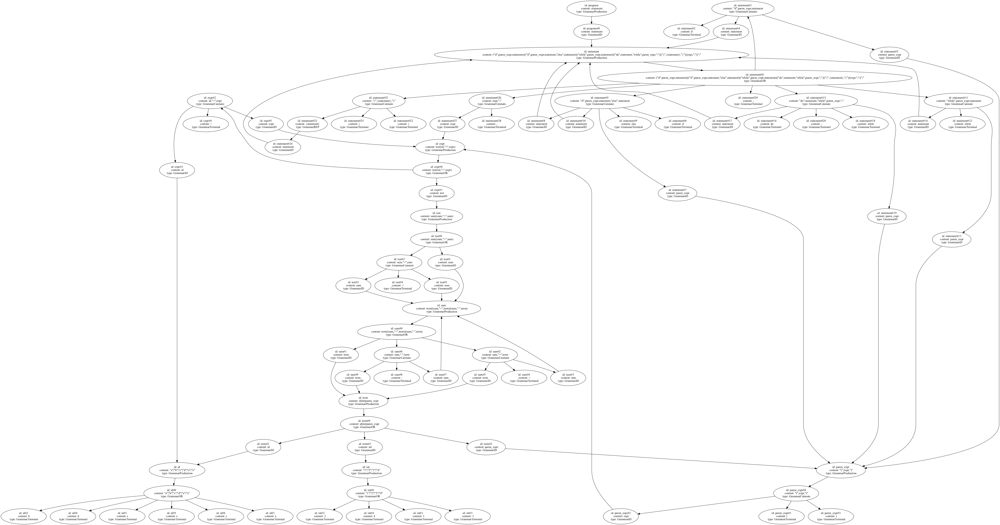
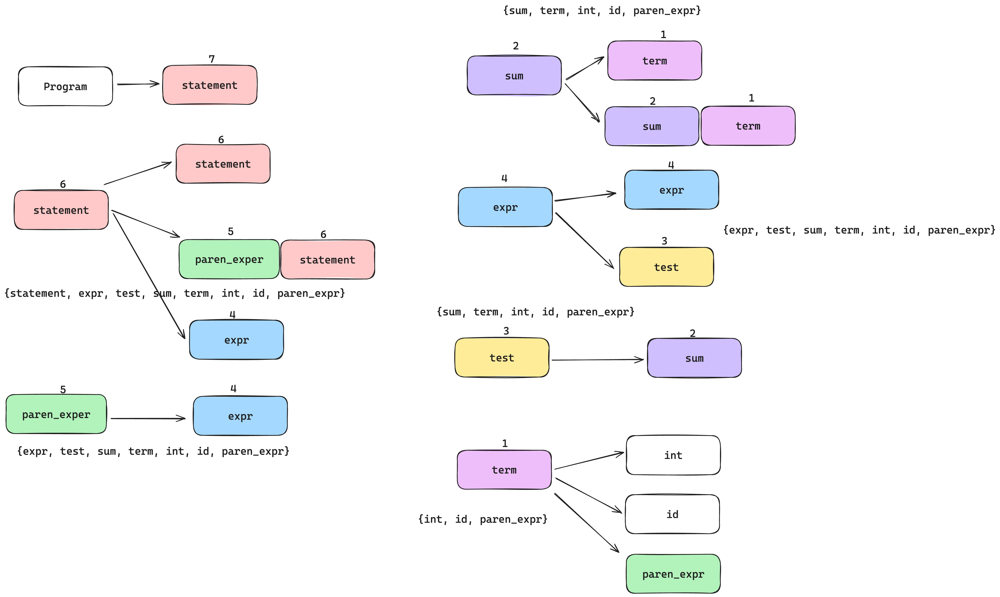

.. _grammar_graph:

Grammar Graph
===============

语法图, 顾名思义, 是与语法树对应的。语法图是一个语法文件的图结构表示, 之所以叫做语法图, 是因为该语法里包含“环”, 而通常所说的抽象语法树(AST), 是这个语法图将环展开后的版本, 因此被称为语法树。

.. code-block:: python

    program = statement;

    statement = ("if", paren_expr, statement)
        | ("if", paren_expr, statement, "else", statement)
        | ("while", paren_expr, statement)
        | ("do", statement, "while", paren_expr, ";")
        | ("{", { statement }, "}")
        | (expr, ";")
        | ";"
        ;

    paren_expr = "(", expr, ")";

    expr = test
        | (id, "=", expr)
        ;

    test = sum
        |( sum, "<", sum)
        ;

    sum = term | (sum, "+", term) | (sum, "-", term);
    term = id | int | paren_expr;
    id = "a" | "b" | "c" | "d" | "e" | "z";
    int = "1" | "2" | "3" | "4";

例如下面是简化版的C语言语法所输出的图。

语法图里会包含不同的节点，节点的类型包括：

- Production: 代表一个语法文件的起始，在上述的tinyc语法中，就是 ``program = statement;``
- Or: 表示可选路径，即 ``int = "1" | "2" | "3" | "4";``，int符号可以选择任意一个数字。
- Catenate: 表示连接，所有符号都要同时包含。例如 ``paren_expr = "(", expr, ")";`` ，此处需要同时包含三个符号。
- Reptition: 表示零次或多次。
- Plus: 表示一次或多次。
- Subtitue: 二元操作符，表示前者集合中除了后者的部分。
- Identifier: 标识符，通常用于开启新的Production。
- Terminal: 终结符，用于表示终止节点。例如 ``int = "1" | "2" | "3" | "4";`` 中的 ``"1"``。

